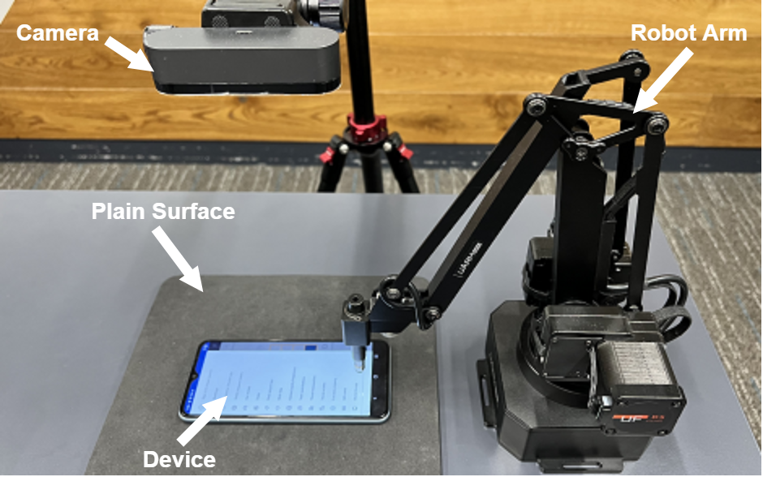

# NiCro: Non-intrusive Cross-device and Cross-platform UI Action Record & Replay
## What is it?

Due to the huge diversity of the hardware and software environment of the end-device, an APP is necessited to be tested on diverse devices to ensure the compatibility and user experience.

    

>An app displayed on various devices. “P“ and “V“ indicate if the device is “Physical“ or “Virtual“; “A“ and “I“ represent “Android“ and “iOS“ platforms; the last number shows the screen size in inches.

This cross-device and cross-platform testing is highly laborious and involves plenty of repetitive work to run and revise the test script on differnet devices. 

Therefore, we propose the automated UI testing system ***NiCro*** to automatically replay the actions on various devices with different hardware (e.g., screen size) and software (e.g., operating system) environments.

***NiCro*** is a purely non-intrusive system. Its approach only requires GUI images (e.g., screenshot or photo) as the input without any need of the app metadata. This enables it to be highly easy to use and generalize to any types of devices, as it does not demand any specific APIs to hack into the underlying system. 

>The summarized workflow of NiCro

## How does it work?
***NiCro*** contains three parts

1. **Virtual Device Farm**: It supports various Android device emulators with differnet Android versions and screen sizes, which can be easily added or removed.
2. **Robotic System**: It contains one or multiple robot arms and cameras to interact with any type of physical devices.
3. **Host Computer**: It collects the GUI images (e.g., screenshot or photo) from the above two parts and run the core visual approach:
    1. Detect the UI widgets using an accurate computer vision based detector [UIED](https://github.com/MulongXie/UIED).
    2. Find the widget on the replaying device that is matched to the target widget on the recording device.
    3. Match the widget-independent actions (scroll or swipe) from the recording device to the replaying devices.
    4. Output the converted action to the Virtual Device Farm and Robotic System to replay it on diverse devices.

## How to use NiCro?
### Dependency
- **Opencv 4.4**
- **sklearn 0.24**

### Preparation
#### Virtual Device Farm
The Virtual Device Farm is supported through **Android Studio**. The applied version is 2021.1.1.23.
1. Install **Android Studio**.
2. Creat Virtual Devices (emulators).
3. Install the APP on all emulators.

#### Robotic System (Optional)
The Robotic System contains a Robot Arm and a camera. We use a *UArm Swift Pro Robot Arm* and a *4K Logitech BRIO Webcam* in our current experimental setting, but the two can be replaced by any similar alternatives.

    

1. Connect the robot arm.
2. Check `Robot.py` and `robot/` folder to update your robot control script.
3. Run the functions `nicro.load_robot()` and `nicro.robot.control_robot_by_clicking_on_cam_video()` in `NiCro.py` to test it the system connects successfully.

### Usage
>Check [NiCro-main.ipynb](NiCro-main.ipynb) for detailed instructions. 

